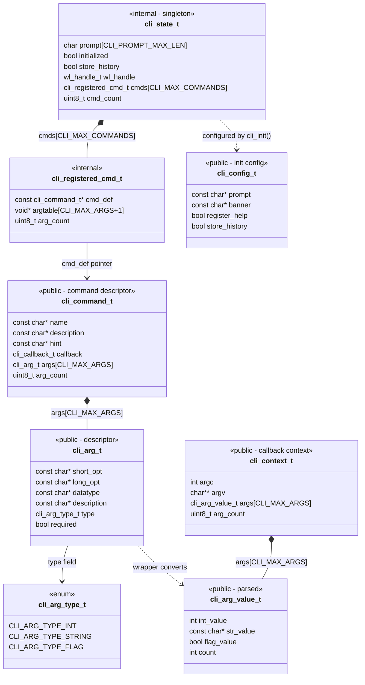

# CLI-API - Simplified Console API for ESP32

A simplified, header-only like API for creating command-line interfaces (CLI) on ESP32 devices. This project wraps the complexity of ESP-IDF's console component and argtable3 library into an easy-to-use interface.

## Features

- **Simple Command Registration**: Define commands using declarative structs instead of complex argtable3 code
- **Multiple Argument Types**: Support for integers, strings, and boolean flags
- **Automatic Help Generation**: Built-in help system for all registered commands
- **Command History**: Persistent command history stored in flash memory
- **Multiple Interface Support**: UART, USB_SERIAL_JTAG, and USB_CDC
- **Example Commands**: Includes WiFi, NVS, and system management commands
- **Clean C API**: No extern "C" wrappers needed, pure C implementation

## How to use example

This example can be used on boards with UART and USB interfaces. The sections below explain how to set up the board and configure the example.

### Using with UART

When UART interface is used, this example can run on any commonly available Espressif development board. UART interface is enabled by default (`CONFIG_ESP_CONSOLE_UART_DEFAULT` option in menuconfig). No extra configuration is required.

### Using with USB_SERIAL_JTAG

*NOTE: We recommend to disable the secondary console output on chips with USB_SERIAL_JTAG since the secondary serial is output-only and would not be very useful when using a console application. This is why the secondary console output is deactivated per default (CONFIG_ESP_CONSOLE_SECONDARY_NONE=y)*

On chips with USB_SERIAL_JTAG peripheral, console example can be used over the USB serial port.

* First, connect the USB cable to the USB_SERIAL_JTAG interface.
* Second, run `idf.py menuconfig` and enable `CONFIG_ESP_CONSOLE_USB_SERIAL_JTAG` option.

For more details about connecting and configuring USB_SERIAL_JTAG (including pin numbers), see the IDF Programming Guide:
* [ESP32-C3 USB_SERIAL_JTAG](https://docs.espressif.com/projects/esp-idf/en/stable/esp32c3/api-guides/usb-serial-jtag-console.html)
* [ESP32-C6 USB_SERIAL_JTAG](https://docs.espressif.com/projects/esp-idf/en/stable/esp32c6/api-guides/usb-serial-jtag-console.html)
* [ESP32-S3 USB_SERIAL_JTAG](https://docs.espressif.com/projects/esp-idf/en/stable/esp32s3/api-guides/usb-serial-jtag-console.html)
* [ESP32-H2 USB_SERIAL_JTAG](https://docs.espressif.com/projects/esp-idf/en/stable/esp32h2/api-guides/usb-serial-jtag-console.html)

### Using with USB CDC (USB_OTG peripheral)

USB_OTG peripheral can also provide a USB serial port which works with this example.

* First, connect the USB cable to the USB_OTG peripheral interface.
* Second, run `idf.py menuconfig` and enable `CONFIG_ESP_CONSOLE_USB_CDC` option.

For more details about connecting and configuring USB_OTG (including pin numbers), see the IDF Programming Guide:
* [ESP32-S2 USB_OTG](https://docs.espressif.com/projects/esp-idf/en/stable/esp32s2/api-guides/usb-otg-console.html)
* [ESP32-S3 USB_OTG](https://docs.espressif.com/projects/esp-idf/en/stable/esp32s3/api-guides/usb-otg-console.html)

### Other configuration options

This example has an option to store the command history in Flash. This option is enabled by default.

To disable this, run `idf.py menuconfig` and disable `CONFIG_CONSOLE_STORE_HISTORY` option.

### Configure the project

```
idf.py menuconfig
```

* Enable/Disable storing command history in flash and load the history in a next example run. Linenoise line editing library provides functions to save and load
  command history. If this option is enabled, initializes a FAT filesystem and uses it to store command history.
  * `Example Configuration > Store command history in flash`

* Accept/Ignore empty lines inserted into the console. If an empty line is inserted to the console, the Console can either ignore empty lines (the example would continue), or break on emplty lines (the example would stop after an empty line).
  * `Example Configuration > Ignore empty lines inserted into the console`

### Build and Flash

Build the project and flash it to the board, then run monitor tool to view serial output:

```
idf.py -p PORT flash monitor
```

(Replace PORT with the name of the serial port to use.)

(To exit the serial monitor, type ``Ctrl-]``.)

See the Getting Started Guide for full steps to configure and use ESP-IDF to build projects.

## Data Structures

The diagram below shows all the structs in the project and how they relate to each other:



**Flow summary:**
- **Registration:** You define a `cli_command_t` (which contains `cli_arg_t` descriptors). When registered, a `cli_registered_cmd_t` is created internally with argtable3 structs and stored in `cli_state_t`.
- **Execution:** When the user types a command, the wrapper parses arguments via argtable3, converts them into `cli_arg_value_t` values, packs everything into a `cli_context_t`, and calls your callback.
- **Initialization:** `cli_config_t` is passed to `cli_init()` which copies its values into the `cli_state_t` singleton.

### Visual Flow

The example below shows how a user-defined command (`echo`) is stored internally and linked back through `cmd_def`:

```
User defines:                       API stores internally:

cli_command_t echo_cmd = {          cli_registered_cmd_t {
  .name = "echo",                     .cmd_def ──────────► &echo_cmd
  .callback = cmd_echo,               .argtable[0] = arg_str1(...)  ← generated
  .args[0] = { "-m", ... },           .argtable[1] = arg_int0(...)  ← generated
  .args[1] = { "-n", ... },           .argtable[2] = arg_end(...)   ← generated
  .arg_count = 2,                     .arg_count = 2
};                                  }
```

At **execution time**, when the user types `echo -m "hello" -n 3`:

```
1. esp_console calls cli_command_wrapper(argc, argv)
                          │
2. Finds matching         │    cli_registered_cmd_t.cmd_def->name == "echo"
   registered command     │
                          ▼
3. arg_parse()       argtable[0] (arg_str) ← "hello"
   fills argtable    argtable[1] (arg_int) ← 3
                          │
4. Wrapper reads          │    cmd_def->args[i].type tells how to extract
   each arg type          │
                          ▼
5. Builds context    cli_context_t {
                       .args[0] = { .str_value = "hello", .count = 1 }
                       .args[1] = { .int_value = 3,       .count = 1 }
                     }
                          │
6. Calls callback         ▼
                     cmd_def->callback(&ctx)  →  cmd_echo(ctx)
```

## CLI-API Reference

### Core Functions

- **`cli_init(const cli_config_t *config)`** - Initialize the CLI console system
- **`cli_run(void)`** - Start the interactive console loop (blocking)
- **`cli_deinit(void)`** - Clean up and free resources
- **`cli_register_command(const cli_command_t *cmd)`** - Register a command with arguments
- **`cli_register_simple_command(name, description, callback)`** - Register a simple command without arguments
- **`cli_register_commands(commands[], count)`** - Register multiple commands at once

## Troubleshooting

### Line Endings

The line endings in the Console Example are configured to match particular serial monitors. Therefore, if the following log output appears, consider using a different serial monitor (e.g. Putty for Windows) or modify the example's [UART configuration](#Configuring-UART).

```
This is an example of ESP-IDF console component.
Type 'help' to get the list of commands.
Use UP/DOWN arrows to navigate through command history.
Press TAB when typing command name to auto-complete.
Your terminal application does not support escape sequences.
Line editing and history features are disabled.
On Windows, try using Windows Terminal or Putty instead.
esp32>
```

### Escape Sequences on Windows 10

When using the default command line or PowerShell on Windows 10, you may see a message indicating that the console does not support escape sequences, as shown in the above output. To avoid such issues, it is recommended to run the serial monitor under [Windows Terminal](https://en.wikipedia.org/wiki/Windows_Terminal), which supports all required escape sequences for the app, unlike the default terminal. The main escape sequence of concern is the Device Status Report (`0x1b[5n`), which is used to check terminal capabilities. Any response to this sequence indicates support. This should not be an issue on Windows 11, where Windows Terminal is the default.

### No USB port appears

On Windows 10, macOS, Linux, USB CDC devices do not require additional drivers to be installed.

If the USB serial port doesn't appear in the system after flashing the example, check the following:

* Check that the USB device is detected by the OS.
  VID/PID pair for ESP32-S2 is 303a:0002.

  - On Windows, check the Device Manager
  - On macOS, check USB section in the System Information utility
  - On Linux, check `lsusb` output

* If the device is not detected, check the USB cable connection (D+, D-, and ground should be connected)

## Implementation Details

### CLI-API Initialization

The `cli_init()` function handles:
- NVS initialization for persistent storage
- FATFS setup for command history
- Console peripheral configuration (UART/USB)
- Linenoise library setup with line editing, completion, and history

### Command Registration

CLI-API provides two registration methods:

1. **Simple Commands** (no arguments):
   ```c
   cli_register_simple_command("hello", "Prints Hello World", cmd_hello);
   ```

2. **Complex Commands** (with arguments):
   ```c
   cli_register_command(&echo_cmd);
   ```

The library automatically:
- Allocates argtable3 structures
- Configures argument parsing
- Registers with esp_console
- Handles cleanup on errors

### Argument Parsing

The CLI-API wrapper automatically:
- Parses command-line arguments using argtable3
- Validates required vs optional arguments
- Converts strings to appropriate types (int, string, bool)
- Provides parsed values in a clean `cli_context_t` structure
- Displays helpful error messages on invalid input

### Command History

When `store_history = true`:
- A FAT filesystem is mounted on the "storage" partition
- Command history is saved to `/data/history.txt`
- History persists across reboots
- Accessible via UP/DOWN arrow keys in the console

## References

- [ESP-IDF Console Component Documentation](https://docs.espressif.com/projects/esp-idf/en/latest/esp32/api-reference/system/console.html)
- [Argtable3 Library](http://www.argtable.org/)
- [Linenoise Line Editing Library](https://github.com/antirez/linenoise)
- [ESP-IDF Programming Guide](https://docs.espressif.com/projects/esp-idf/en/latest/esp32/get-started/)
